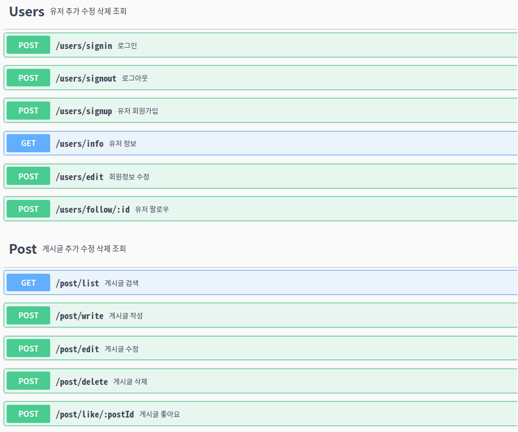
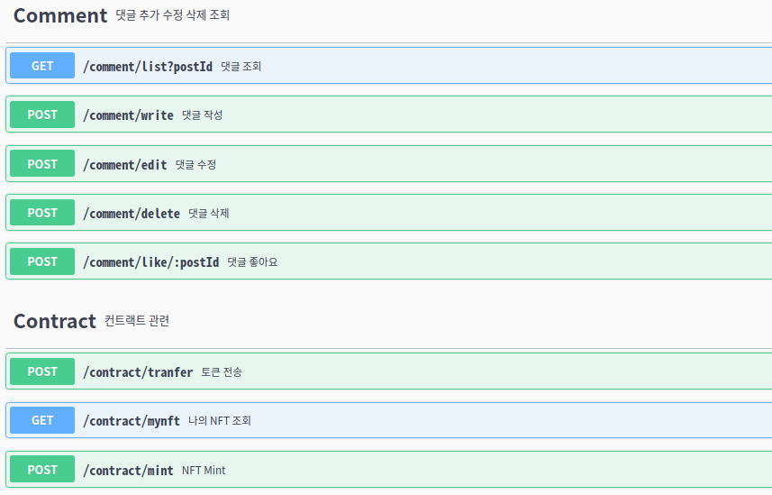

### 📍&nbsp;README [Link](https://github.com/codestates-beb/BEB-06-SECOND-04/)
 

### ⚙️&nbsp;Architecture

  

 
 

 
### 🛠&nbsp;Wireframe
[More Information](https://github.com/codestates-beb/BEB-06-SECOND-04/blob/main/.github/wireFrame/wireFrame.md)
 

 
 

### 📞&nbsp;Server API Docs.

  
  

 
  

### 💽&nbsp;DataBase Schema

  

 
  

---
> ### 📦&nbsp;Version 
---
 

## Client  

  
 
 
 
 
 

## Server  

 
 
 
 
 
 
 
