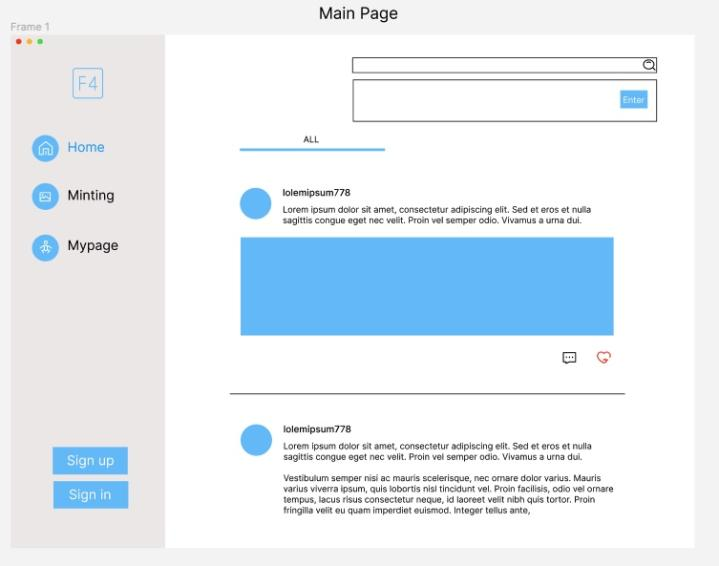
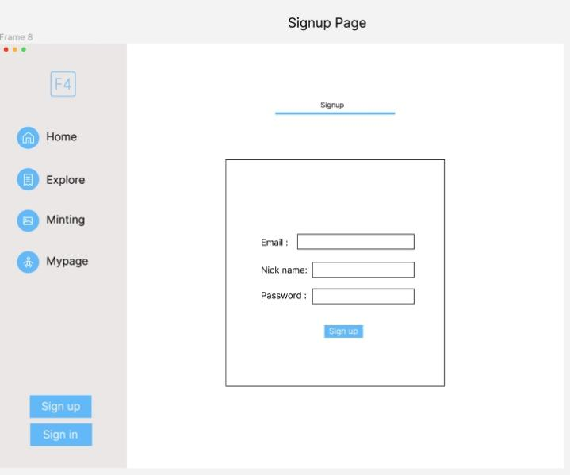
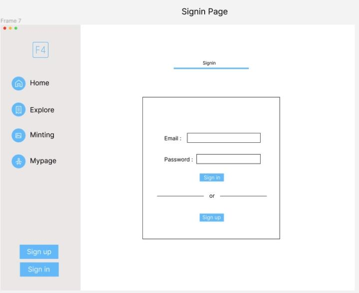
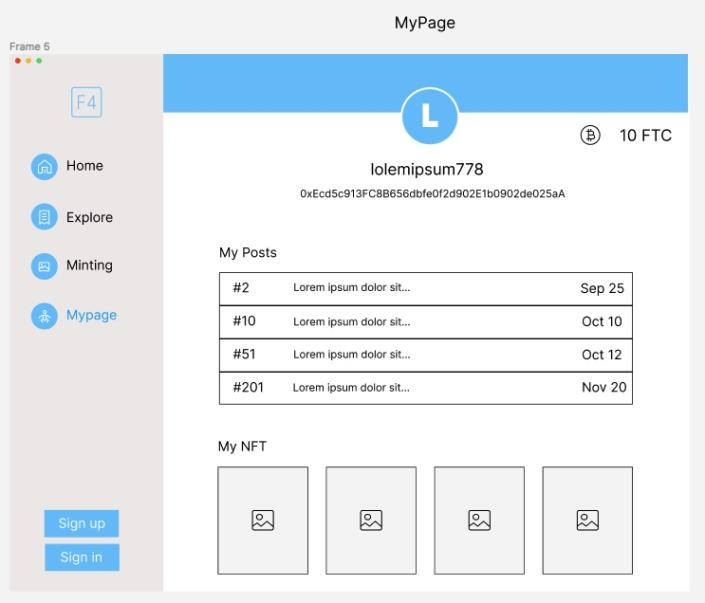
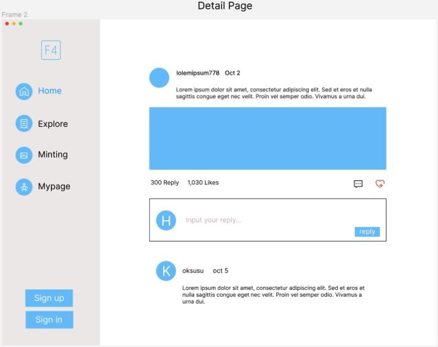
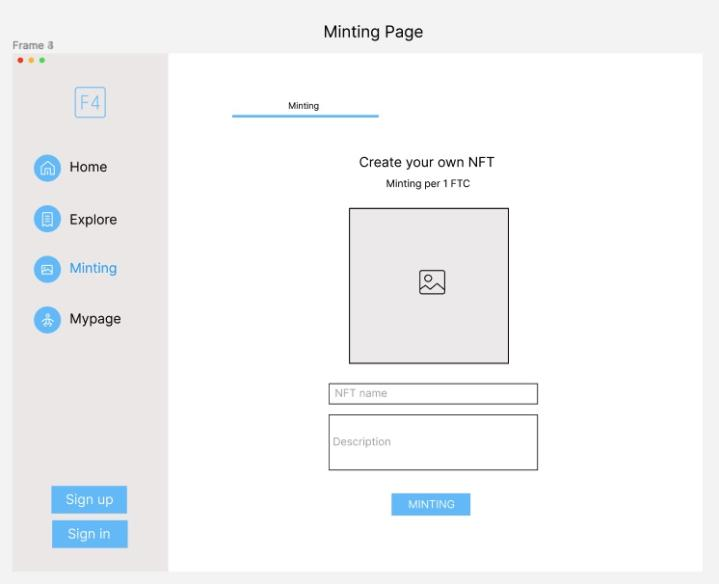

### 📍&nbsp;README [Link](https://github.com/codestates-beb/BEB-06-SECOND-04/)
### 📖&nbsp;WIKI [Link](https://github.com/codestates-beb/BEB-06-SECOND-04/wiki)
 
 

### 🛠&nbsp;Wireframe
 

  
  
  
  
  
  

