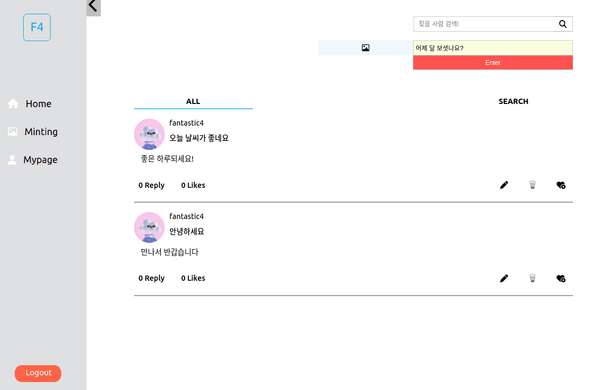
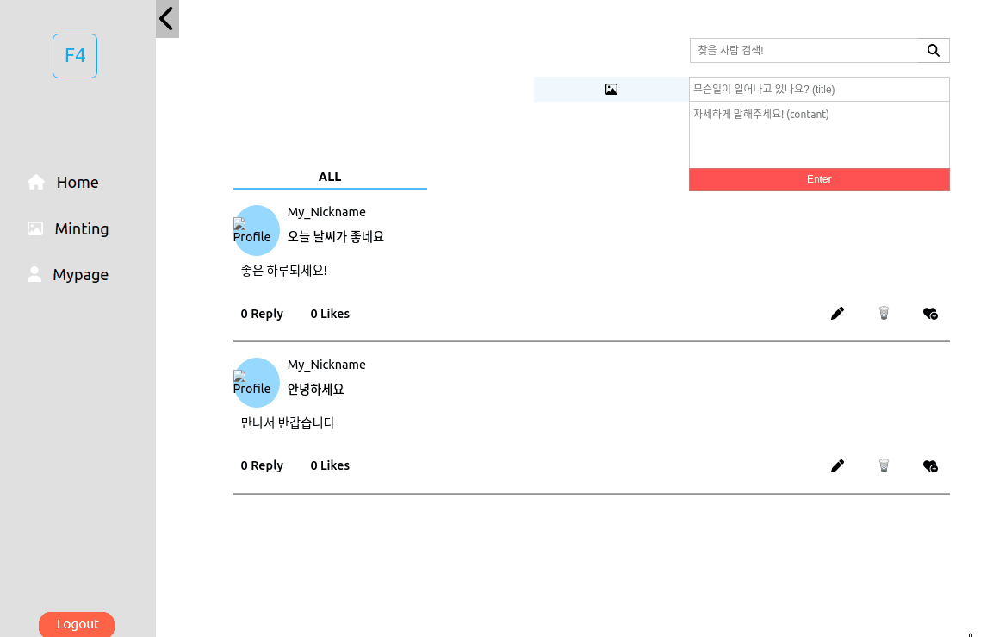
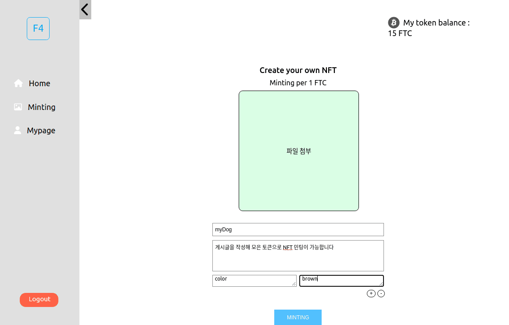

[](https://github.com/codestates-beb/BEB-06-SECOND-04)
</br>
</br>

[블로그정리](https://velog.io/@hd3946/%ED%94%84%EB%A1%9C%EC%A0%9D%ED%8A%B82-Incentive-Community-%ED%81%B4%EB%A1%A0%EC%BD%94%EB%94%A9)

# 👋&nbsp;Introduce
### Fantastic 4️ <br />
오늘 나의 일들을 기록하고, 댓글을 달고 좋아요를 눌러 커뮤니티에 참여하세요 <br /> 참여할수록 토큰을 모을 수 있고 토큰으로 나의 NFT를 민팅 할 수 있습니다! <br />

### 📖&nbsp;WIKI [More Information](https://github.com/codestates-beb/BEB-06-SECOND-04/wiki)

<br />
<br />

# 👨‍👨‍👧&nbsp;Members

||Role|Github|
|---|:---:|:---:|
|곽규명|Front(팀장)|https://github.com/MJKM9163|
|김나혜|Front|https://github.com/kimnahye123|
|이민욱|Server&SC|https://github.com/yiminwook|
|임형대|Server&DB|https://github.com/hd3946|

<br />
<br />


# ✈️&nbsp;Getting Started
>### Client
&nbsp;&nbsp;```npm install```<br />
&nbsp;&nbsp;```npm start```<br />
<br />

>### Server
[More Information](https://github.com/codestates-beb/BEB-06-SECOND-04/tree/main/server)
<br />

<br />
<br />

# 📝&nbsp;Instruction
>### Signup & in
<br />
<p align="center">
	
</p>
<br />

>### Mypage
<br />
<p align="center">
	
</p>
<br />

>### Communication
<br />
<p align="center">
	
	
</p>
<br />

>### Mint NFT
<br />
<p align="center">
	
</p>


