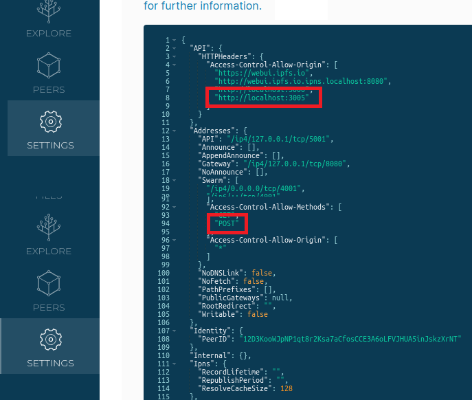

## Getting Start Server
 

## Require 
-----
> IPFS Desktop [Install](https://ipfs.tech/#install)  
> Ganache [Intall](https://trufflesuite.com/ganache)  
> truffle [`npm install -g truffle`](https://www.npmjs.com/package/truffle)  
> Mysql CLI or Workbench [Install](https://dev.mysql.com/downloads/)  
> OPTION: Metamask [Install](https://metamask.io/)  

 

## Step  
-----
#### 1. `npm install`  
#### 2. Ganache 실행 (Default. PORT: 7545, NetworkID 5777)
#### 3. IPFS Desktop 실행 (AllowOrigin: "http:localhost:3005", Methods: "GET", "POST")
#### 4. `cd truffle` (Go to truffle file)
#### 5. `truffle migration`&nbsp;&nbsp;(deploy Contract) 
#### 6. `cd ..`(Go back to server file)
#### 7. clone .env.example and rename .env
#### 8. input .env arguments
#### 9. Create Mysql DB &nbsp;&nbsp;[`CREATE DATABASE INPUT_YOUR_DATABASE;`](https://www.w3schools.com/mysql/mysql_create_db.asp)
#### 9. `npm start`

 
 

-----
 

### 메타마스크 Remix로 contract deploy 방법
#### 1. Ganache 실행
#### 2. 메타마스크 Ganache 네트워크 추가 &nbsp;&nbsp; (RPC - http://127.0.0.1:7545 &nbsp; chainID - 1337)  
#### 3. 메타마스크에 Ganache account 가져오기 
#### 4.  remix로 contract를 불러와서 Ganache 네트워크에 Deploy &nbsp; (compile version v0.8.10)

 
 

### IPFS Desktop CORS setting

  

 
 

-----
> ## version 
-----
<pre>
web3 v1.8.0
Ganache v2.5.4
Truffle v5.5.31 (core: 5.5.31)
@openzeppelin/contracts v4.7.3
ipfs-http-client v57.0.0
mysql v8.0.31
sequelize v6.25.3
sequelize-cli v6.5.2
axios v1.1.3
</pre>
